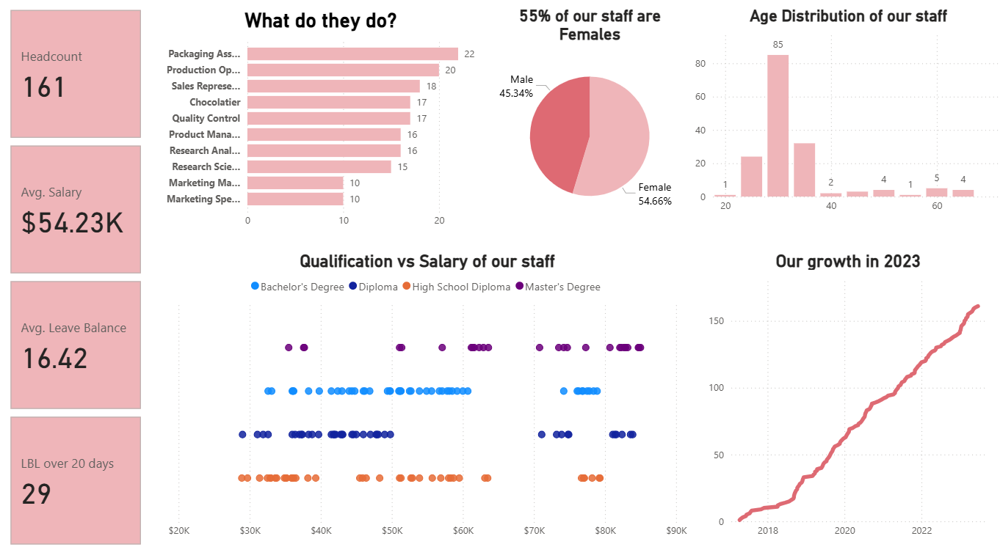

# HR Analytics Dashboard

## Project Overview

This project is an interactive HR Analytics Dashboard built using Power BI to analyze workforce trends and employee data.

### The dashboard provides insights into
- Employee demographics
- Gender distribution
- Salary trends
- Leave balance
- Headcount analysis

### Tools Used
- Power BI
- DAX
- Excel

### Key Insights
- Identified workforce distribution across departments
- Analyzed average salary trends
- Visualized employee leave patterns
- Built KPI-based dashboards for HR reporting

### Dashboard Preview

### Skills Demonstrated
- Data Visualization
- Dashboard Development
- KPI Reporting
- Business Analytics
- Data Storytelling
